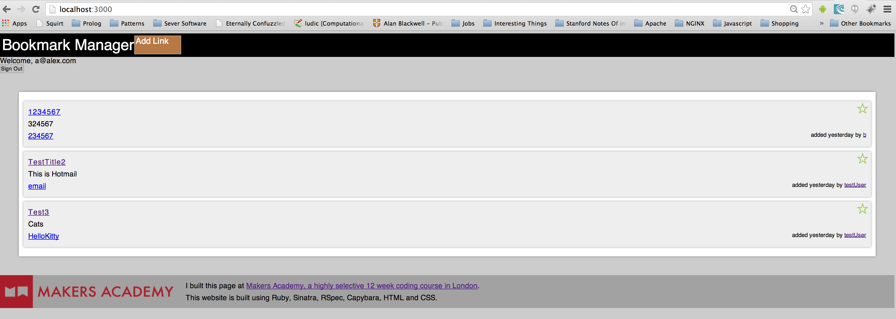

Bookmark-Manager
===
Click this [Example] to see the website on Heroku.
A week 5 Makers Academy challenge. This is a site to create bookmarks similar to [Delicious.com]. i.e. account, login, post links, recover your password if necessary.



What could be done
----
- Frontend, responsivness
- Connecting individual views into a working website
- Diverse validations

Objectives of exercise
----
Utilizing the Mailgun API and creating a fully functioning Sinatra app with a good filestructure, DRY-principle and readable code.

Technologies used
----
- Ruby
- Sinatra
- HTML5
- CSS3
- Git
- Heroku
- Postgresql
- jQuery
- Javascript
- Rspec
- Cucumber
- Capybara
- Bcrypt
- [Mailgun API]
- Datamapper

How to run it
----
```sh
git clone git@github.com:NicoSa/Bookmark-Manager.git
cd Bookmark-Manager
shotgun -p 3000 server.rb
```
open localhost:3000 in your browser

How to run tests
----
```sh
cd Bookmark-Manager
rspec
cucumber
```
[Mailgun API]:http://documentation.mailgun.com/quickstart.html
[Chitter]:https://github.com/NicoSa/Chitter
[Delicious.com]:https://delicious.com/
[Example]:http://limitless-scrubland-6059.herokuapp.com/